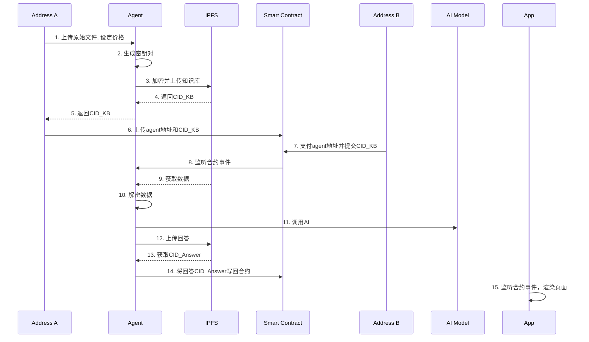

# 流程图

```mermaid

sequenceDiagram

participant Address A

participant Agent

participant IPFS

participant Smart Contract


participant Address B
participant AI Model
participant App

%% Address A's simplified setup

Address A->>Agent: 1. 上传原始文件, 设定价格
Agent->>Agent: 2. 生成密钥对
Agent->>IPFS: 3. 加密并上传知识库
IPFS-->>Agent: 4. 返回CID_KB
Agent-->>Address A: 5. 返回CID_KB

Address A->>Smart Contract: 6. 上传agent地址和CID_KB


%% Address B's super-simplified interaction

Address B->>Smart Contract: 7. 支付agent地址并提交CID_KB

Smart Contract->>Agent: 8. 监听合约事件

IPFS-->>Agent: 9. 获取数据

Agent->>Agent: 10. 解密数据

%% Server processing for public answer

Agent->>AI Model: 11. 调用AI

Agent->>IPFS: 12. 上传回答

IPFS-->>Agent: 13. 获取CID_Answer

Agent->>Smart Contract: 14. 将回答CID_Answer写回合约

App->>App: 15. 监听合约事件，渲染页面

```