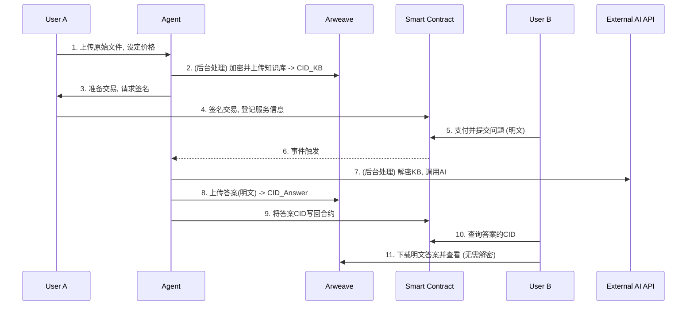

```mermaid
sequenceDiagram
participant User A
participant Agent
participant Arweave
participant Smart Contract
participant User B

%% User A's simplified setup
User A->>Agent: 1. 上传原始文件, 设定价格
Agent->>Arweave: 2. (后台处理) 加密并上传知识库 -> CID_KB
Agent->>User A: 3. 准备交易, 请求签名
User A->>Smart Contract: 4. 签名交易, 登记服务信息

%% User B's super-simplified interaction
User B->>Smart Contract: 5. 支付并提交问题 (明文)
Smart Contract-->>Agent: 6. 事件触发

%% Server processing for public answer
Agent->>External AI API: 7. (后台处理) 解密KB, 调用AI
Agent->>Arweave: 8. 上传答案(明文) -> CID_Answer
Agent->>Smart Contract: 9. 将答案CID写回合约

%% User B gets public answer
User B->>Smart Contract: 10. 查询答案的CID
User B->>Arweave: 11. 下载明文答案并查看 (无需解密)
```